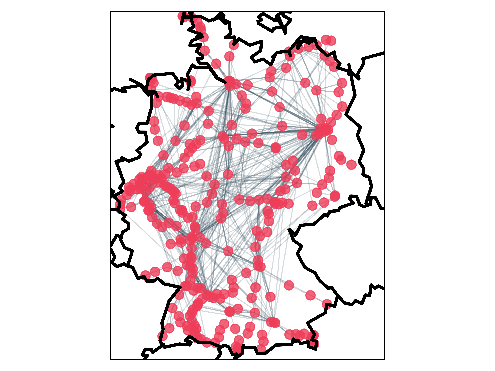

# Identifying contributing factors of train delay through Social Network Analysis
## a Social Network Analysis Research Project

This the final project for the module 'Social Network Analysis' where we were required to do a Social Network Analysis Case Study.

#### Abstract
Although the German railway network is considered the largest in Europe, it is also infamous for being very unreliable. Since 70 percent of long-distance trains are considered to be not punctual, the German government introduced a railway spending programme with the aim of reducing delays and making the train a more desirable mode of transportation. In order for the spending programme to be successful, it is necessary to identify the factors that cause delays. In this paper, several of these factors will be shown, retrieved from a linear regression analysis. The study revealed that specific train station operators and control centers exert an influence on train delay, both positively and negatively. These insights can be employed to identify optimal train organisation strategies and implement them across the entire network. Furthermore, this research can serve as a foundation for identifying other crucial influences through the utilisation of a larger data set containing more information.

#### Visualization
Here is a visualization of the network I build

